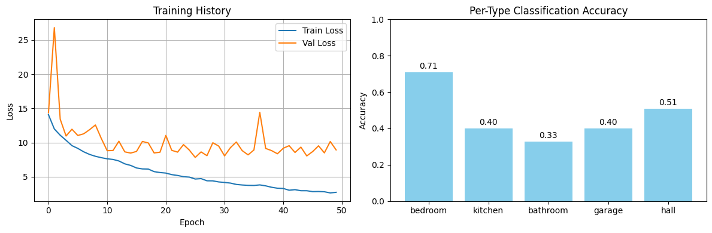

# Real Estate Search Engine

## Overview
This project is an end-to-end Real Estate Search Engine that uses deep learning to analyze floorplan images, extract room counts, and store property data for semantic search and retrieval. It includes:
- Data ingestion and ETL pipeline
- AI model for floorplan room count detection
- Database and vector search integration
- FastAPI backend and Streamlit frontend

## Directory Structure
```
Real-Estate-Search-Engine/
├── src/
│   ├── agents/
│   ├── data ingestion/
│   │   ├── app.py
│   │   ├── database_schema.py
│   │   ├── ETL_pipeline.py
│   │   ├── inference.py
│   │   ├── main.py
│   │   ├── realestate.db
│   │   ├── temp_uploads/
│   │   └── vector_db/
│   └── training/
│       ├── annotations2.coco.json
│       ├── checkpoint_epoch_50.pth
│       ├── help.ipynb
│       ├── model_training.ipynb
│       └── README_Training.md
├── requirements.txt
├── .gitignore
├── .dockerignore
├── .env(example)
├── Docker.backend
├── Docker.frontend
└── README.md
```

## Model Training Results
The model is trained using a ResNet-18 backbone as a multi-head classifier for room counts. Training and validation loss curves, as well as per-type accuracy, are plotted in `model_training.ipynb`.

**Training History Plot:**  
Shows the training and validation loss over epochs.



**Per-Type Classification Accuracy Plot:**  
Shows the accuracy for each room type (bedroom, kitchen, bathroom, garage, hall).

Key metrics (from test set):
- Overall Room Count Accuracy: ~40%
- Mean Absolute Error (MAE): ~2.36 rooms
- IoU Approximation (Count-Based): ~0.58
- Per-Type Accuracy: Bedroom 70.91%, Kitchen 40.00%, Bathroom 32.73%, Garage 40.00%, Hall 50.91%

## How to Run the Project

### 1. Install Dependencies
Create a virtual environment (recommended):
```powershell
python -m venv venv
venv\Scripts\activate
pip install --upgrade pip
pip install -r [requirements.txt]
```

## 2. Train the Model
Run the training notebook or script in `src/training/model_training.ipynb` to retrain the model. The trained weights are saved as `checkpoint_epoch_50.pth`.

## 3. Run the ETL Pipeline
This ingests property data, parses floorplan images, and populates the database:
```powershell
python src/data ingestion/ETL_pipeline.py
```

## 4. Start the FastAPI Backend
Launch the API server for property search and retrieval:
```powershell
uvicorn src.data.ingestion.app:app --reload
```
The API will be available at `http://localhost:8000`.

## 5. Start the Streamlit Frontend
Launch the interactive UI for property search:
```powershell
streamlit run src/data ingestion/main.py
```

## Usage Process
1. Place your property Excel file and images in the appropriate assets directory.
2. Run the ETL pipeline to ingest and process data.
3. Start the FastAPI backend for API access.
4. Start the Streamlit frontend for user interaction.
5. Search, filter, and explore properties using semantic and room-based queries.